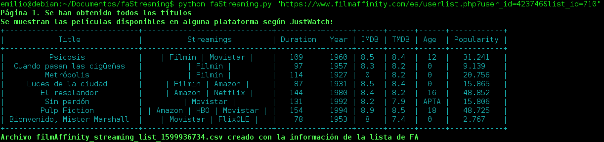

# faStreaming

**faStreaming** es una herramienta hecha en Python 3 cuya función es, a partir de una dirección URL recibida de una lista de FilmAffinity accesible de forma pública, devuelve un fichero CSV y una tabla con la lista de títulos junto con las plataformas de Streaming disponibles en España, así como otra información relevante (puntuación en IMDB, popularidad...). 

Requisitos previos
======

Antes de ejecutar la herramienta es necesario contar con Python 3 y pip 3:

```bash
apt install python3 python3-pip -y
```

Una vez instalados se deberán instalar las dependencias de Python, para ello se debe usar el fichero requirements.txt.

```bash
pip install -r requirements.txt
```

Ya está todo listo para que la herramienta funcione.

Funcionamiento de faStreaming
======

El funcionamiento básico de la herramienta es el siguiente:

<p align="center">

</p>

Se debe llamar a la herramienta indicando entre comillas la dirección web de la lista objetivo y, por defecto, la herramienta se pondrá a buscar cada una de las películas de la lista en JustWatch y devolverá por pantalla la información obtenida. También creará un fichero CSV con dicha información. 